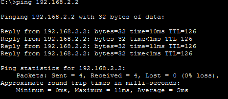
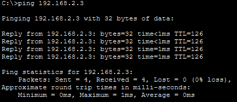

# Lab 5: Configuration of Static Routes and Default Routes

## Objective

* To understand the working principles of static routing and default routing in a network.
* To configure static routes and default routes using both the graphical interface and CLI in Cisco Packet Tracer.

## Theory

### Static Routing

Static routing is a routing technique in which routes are manually configured by a network administrator. These routes do not change automatically and remain in the routing table until they are modified or removed. Static routing is best suited for small or stable networks where network paths are predictable and administrative control is required.

### Default Routing

Default routing is used when no specific route to a destination network exists in the routing table. It acts as a gateway of last resort, forwarding packets to a predefined next-hop router. This method is commonly used to forward traffic toward external or unknown networks.

### Command Line Interface (CLI)

The Command Line Interface (CLI) allows administrators to configure and manage network devices using text-based commands. CLI provides greater flexibility and control over device configuration and is widely used for troubleshooting and advanced network management.

## Procedure

1. Open Cisco Packet Tracer and design a network topology consisting of at least two routers connected to multiple networks with end devices.

2. Assign appropriate IP addresses, subnet masks, and default gateways to all routers and end devices.

3. Configure static routes on each router to enable communication between different networks using the CLI.

   **General Command Format:**

   ```
   Router(config)# ip route <destination_network> <subnet_mask> <next_hop_address or exit_interface>
   ```

   **Example: Router 1**

   ```
   Router> enable
   Router# configure terminal
   Router(config)# ip route 192.168.2.0 255.255.255.0 10.0.0.2
   ```

   **Example: Router 2**

   ```
   Router> enable
   Router# configure terminal
   Router(config)# ip route 192.168.1.0 255.255.255.0 10.0.0.1
   ```

4. Configure a default route on each router to handle packets destined for unknown networks.

   **General Command Format:**

   ```
   Router(config)# ip route 0.0.0.0 0.0.0.0 <next_hop_address or exit_interface>
   ```

   **Example: Router 1**

   ```
   Router> enable
   Router# configure terminal
   Router(config)# ip route 0.0.0.0 0.0.0.0 10.0.0.2
   ```

   **Example: Router 2**

   ```
   Router> enable
   Router# configure terminal
   Router(config)# ip route 0.0.0.0 0.0.0.0 10.0.0.1
   ```

5. Verify the routing configuration by testing connectivity between devices located on different networks using the ping command.

   ```
   ping <destination_IP_address>
   ```

## Observations

* Devices on different networks were able to communicate successfully after configuring static and default routes.
* The routing tables correctly forwarded packets to their respective destinations.

## Output

| Static Routing Test                                                         | Default Routing Test                                                           |
| --------------------------------------------------------------------------- | ------------------------------------------------------------------------------ |
|  <br> *Ping result using Static Route* |  <br> *Ping result using Default Route* |

## Conclusion

This experiment helped in understanding how routers make forwarding decisions using static and default routes. Static routing proved to be effective for explicitly defining network paths, while default routing simplified packet forwarding for unknown destinations. The lab reinforced the importance of correct route configuration to ensure reliable end-to-end communication in a network.
